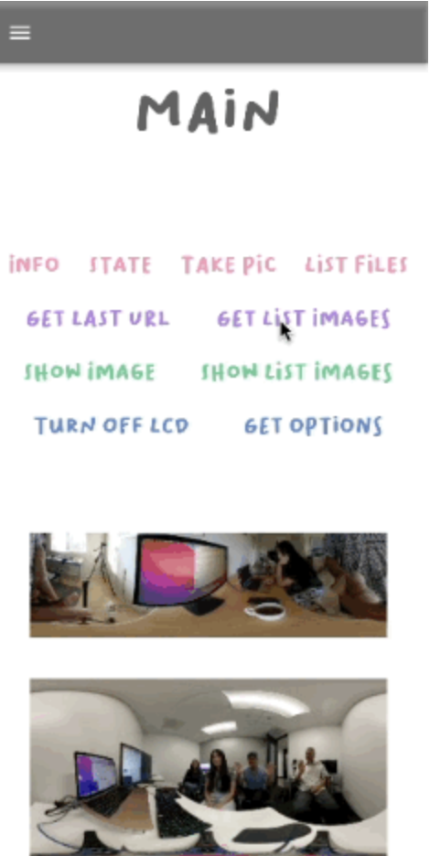
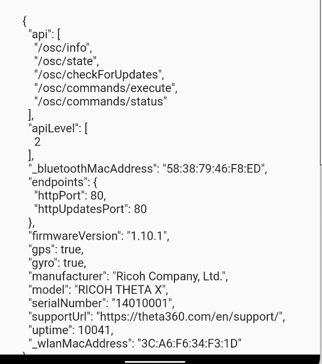
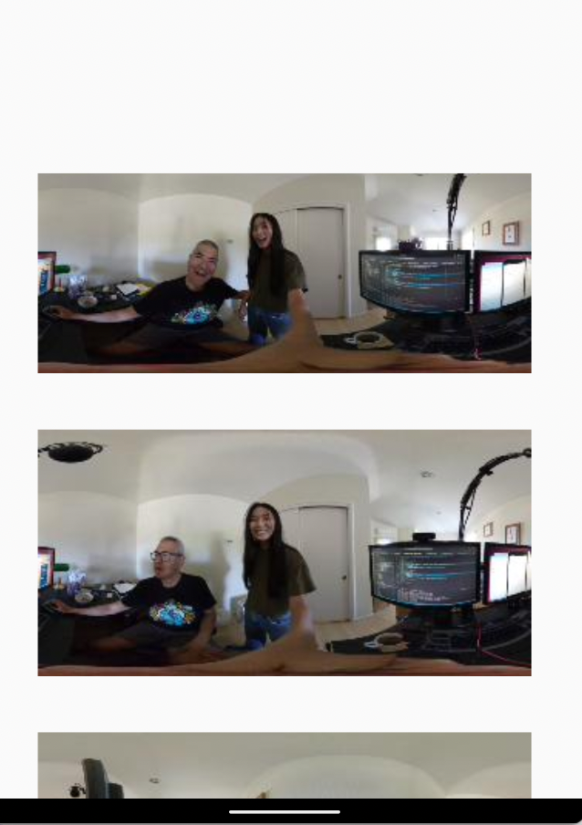
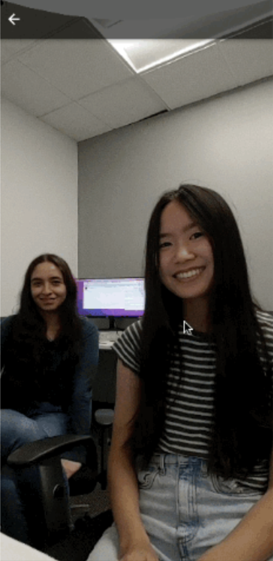
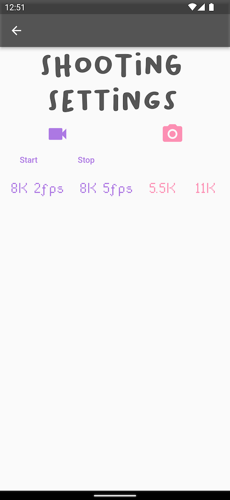
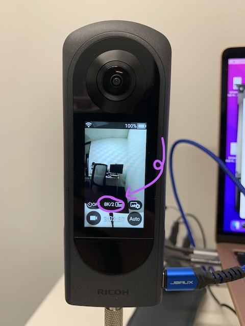

# Using BLoc for more scalable state management

This tutorial is the third in a series aimed at helping developers learn how to work with the RICOH THETA X camera. It focuses on using the API to build a mobile app. The examples provided use Flutter to build mobile apps. Source code is downloadable and open to pull requests on GitHub.

# Main Resources

* [RICOH THETA API](https://api.ricoh/docs/theta-web-api-v2.1/)
* [theta360.guide developers community](https://theta360.guide/)
* [Code for this tutorial](https://github.com/theta360developers/theta_x_gs3)

## Getting Started

Business LOgic Component (BLoC) is used to create more scalable state management. If you use set state, is easier to set up becaused everything is in one file: main.dart. However, eventually, this can get unwieldily and long. Separating the GUI, logic, state, and events makes it easier to organize more buttons and screens as an app gets more complex. 

BLoC basically means that everything in the app is represented as stream of events: widgets submit events; other widgets will respond. BLoC sits in the middle, managing the interactions.

BloC makes it easier to access the state anywhere, like with buttons, response windows with text, images, lists of images. When using set state, you just put all the buttons in one file. With BloC, a column of buttons is made into its own file, with its own widget which holds all the buttons. View has a directory for button and response_window.

It's possible but difficult to do this with set state. This is why Bloc exists. When you extract out the widgets, that's when you see the advantage of Bloc over set state. 

### Fundamental concepts

Event: An external (or sometimes internal) stimulus that an application receives.

State: The internal properties or attributes of an application. Or the values of the properties of an application.

Event - State Relationship: When the application receives an event, in general, some logic or process is executed that modifies the state of the app. The change is (often) reflected in the user interface.


# THETA X Bloc App



This application utilizes Bloc to handle state management. The connection to the camera is 
handled by the http package inside of the Bloc. The application shows the use of commands such as listFiles from the THETA Web API. 

```dart
var url = Uri.parse('http://192.168.1.1/osc/commands/execute');
    var header = {'Content-Type': 'application/json;charset=utf-8'};
    var bodyMap = {
    'name': 'camera.listFiles',
    'parameters': {
        'fileType': 'image',
        'startPosition': 0,
        'entryCount': 1,
        'maxThumbSize': 0
    }
    };
    var bodyJson = jsonEncode(bodyMap);
    var response = await http.post(url, headers: header, body: bodyJson);
    var thetaFiles = jsonDecode(response.body);
    var fileUrl = thetaFiles['results']['entries'][0]['fileUrl'];
    emit(ThetaState(message: fileUrl));
```

## Workarounds

For the THETA X, the `thumbnail` does not appear unless the `_detail` is set to true. The thumbnail only works for a single file. If we need to get multiple thumbnails, then the `startPosition` needs to be changed to a different number and run multiple times. 

Another technique is to get the list of file urls and pass it `fileUrl = fileUrl + "?type=thumb";`. This technique will also show the thumbnail. 

## Bloc Structure

The Bloc structure helps to manage the state across an application and handle events. Previously, I created an application using `setState()`, however, this approach is not very scalable as our application becomes more complex. With the use of Bloc, we can separate out the events and ensure that every file can access the state. The Bloc state management comes from the flutter package. 

### Event

Events in Bloc are executed when an action occurs. For each separate button in the application, I created a specific event. The `GetInfoEvent` below connects to the Info button.

```dart
class GetInfoEvent extends ThetaEvent {}
```
### State

The State is emitted in the Bloc file and holds information in parameters. The State extends Equatable. When the state changes, the screen updates.

### Bloc

Inside of the Bloc file, I have a series of `on` methods that pair an Event with the State. Basically, when an Event occurs, such as tapping on the Info button, the app will get the response from the camera. Next, it passes the response into the State, therefore displaying our text.

```dart
    on<GetInfoEvent>((event, emit) async {
      var url = Uri.parse('http://192.168.1.1/osc/info');
      var response = await http.get(url);
      var encoder = JsonEncoder.withIndent('  ');
      var formattedResponse = encoder.convert(jsonDecode(response.body));
      emit(ThetaState(message: formattedResponse));
    });
```



## ListView

The Show List Images button displays a list of thumbnail images. I created a `ListView` widget that uses the `urlList` to create the images. The list of urls can be accessed once we wrap our widget with a `BlocBuilder`. For the `ListView` widget, I assigned the length to be the length of the `urlList`. Additionally, an Image is created from each item inside of the urlList.

```dart
   return ListView.builder(
    itemCount: state.urlList.length,
    itemBuilder: ((context, index) {
    return Image.network('${state.urlList[index]}?type=thumb');
    }));
```


### Panorama

I imported the Panorama package into the file that displays the full image once the user clicks on the thumbnail. The `Panorama` widget wraps around the `Image.network`. 

```dart
        body: Panorama(child: Image.network(fileUrl));
```


## Shooting Settings

The Shooting Settings screen on the application has several buttons that can switch between video or image mode. There are other specific settings for the image (5.5K and 11K) and the video (8K 2fps and 8K 5fps). Similarly to the other buttons, the shooting settings buttons each have their own event which is handled in the Bloc file. 

### Shooting Settings Features

* [captureMode](https://api.ricoh/docs/theta-web-api-v2.1/options/capture_mode/)
* [fileFormat](https://api.ricoh/docs/theta-web-api-v2.1/options/file_format/)



We can change the `fileFormat` inside of the State with these parameters:

### Parameters for Image

11K Image {“type”: “jpeg”,”width”: 11008,”height”: 5504}
5.5K Image {“type”: “jpeg”,”width”: 5504,”height”: 2752}

### Parameters for Video

8K 5fps Video {“type”: “mp4”,”width”: 7680,”height”: 3840, “_codec”: “H.264/MPEG-4 AVC”, “_frameRate”: 5}
8K 2fps Video {“type”: “mp4”,”width”: 7680,”height”: 3840, “_codec”: “H.264/MPEG-4 AVC”, “_frameRate”: 2}

Once the camera's file format is set, the camera's display changes:


