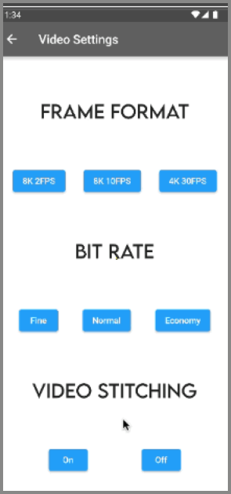
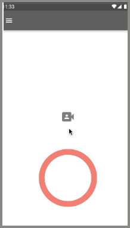
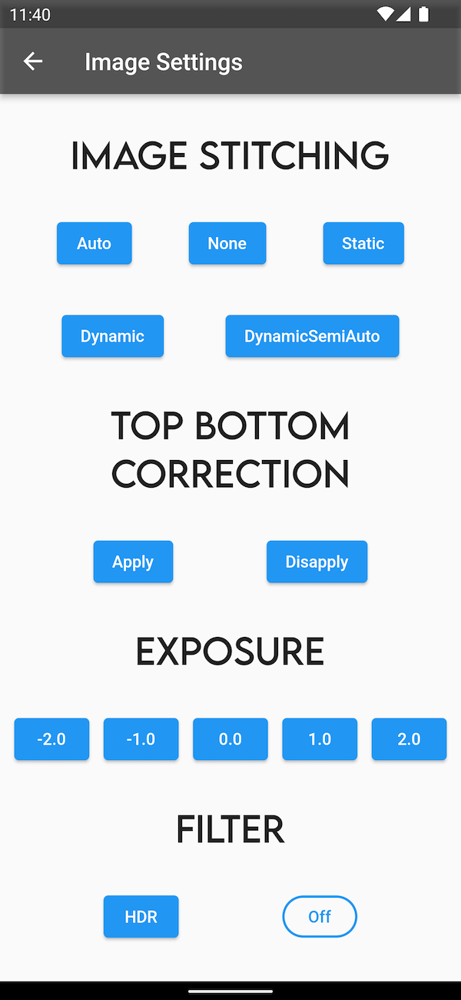
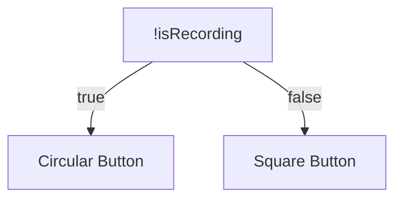
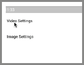

RICOH THETA camera models V, Z1, and X have three modes for capture:

1. image
2. video
3. live streaming

This tutorial covers image and video modes only.

When the application changes or gets a setting that is specific to video, the camera must
first be changed into video mode.  If you attempt to change a setting such as the video file
format when the camera is in image mode, the command will fail.

For example, with the [fileFormat option](https://api.ricoh/docs/theta-web-api-v2.1/options/file_format/), if you set the parameters to image, but have set [captureMode](https://api.ricoh/docs/theta-web-api-v2.1/options/capture_mode/) to video, your app will not function properly.

Your application should be able to switch between the image and video modes for the best
user experience.

This sample app shows how to set up different screens for image and video settings. It sets capture mode to video.

The next application will show how to detect the capture mode when the application first starts.



There are many options for camera settings.  One strategy to organize the UI for a large number of configuration options is 
to use multiple Blocs in a RICOH THETA application. The settings are grouped together on different screens. One Bloc is attached to each screen. 

# Main Resources

* [RICOH THETA API](https://api.ricoh/docs/theta-web-api-v2.1/)
* [theta360.guide developers community](https://theta360.guide/)
* [Code for this tutorial](https://github.com/theta360developers/theta_x_gs4)

## Multiple Blocs

```dart
return MultiBlocProvider(
      providers: [
          BlocProvider<ImageSettingsBloc>(
            create: (context) => ImageSettingsBloc()),
        BlocProvider<CameraUseBloc>(create: (context) => CameraUseBloc()),
        BlocProvider<VideoSettingsBloc>(
            create: (context) => VideoSettingsBloc())
      ],
      child: MaterialApp())
```

In this application, each screen has its own Bloc to make the State more manageable. In the `main.dart` file, I used the `MultiBlocProvider` instead of the `BlocProvider` to list out all the Blocs. This enables me to use multiple Blocs throughout the application.

```dart
return BlocBuilder<VideoSettingsBloc, VideoSettingsState>(
      builder: (context, state) {
        return Scaffold(),
        })
```



For example, in the Video Settings Screen, the `Scaffold` is wrapped with a `BlocBuilder` that uses the `VideoSettingsBloc`. Each screen has its own specific Bloc. 

With the use of Bloc, it's fairly straightforward to create multiple buttons on a screen. 




## Ternary Operator

To switch the recording button into a square, I utilized the ternary operator from Dart. The ternary operator first checks if `isRecording` is false and sets the button to a circular button. Else, when `isRecording` is true, the button is set to a square button. 




```dart
!state.isRecording
                ? IconButton(
                    //circular shape
                    onPressed: () {
                      context.read<CameraUseBloc>().add(StartCaptureEvent());
                    },
                    iconSize: 200,
                    )
                : IconButton(
                    //square shape
                    onPressed: () {
                      context.read<CameraUseBloc>().add(StopCaptureEvent());
                    },)
```


In the `CameraUseBloc`, I set the variable `isRecording` to true when `StartCaptureEvent` is called and false when `StopCaptureEvent` is called. By changing the state of `isRecording`, the button will change its shape. 

## Chopper

[Chopper](https://pub.dev/packages/chopper) is a Flutter package that generates http requests and helps organize the code.

### How to Use

1. Download Chopper package and create a new file (ex: `theta_service.dart`)
2. Import the Chopper package into this file and use the `@ChopperApi` annotation above the class declaration. The `@ChopperApi` has the parameter `baseUrl` which is the url for the THETA camera.

```dart 
@ChopperApi(baseUrl: 'http://192.168.1.1/osc')
abstract class ThetaService extends ChopperService {}
```

3. Use the `@Post` request and pass in the `path` and `headers`. The `path` and `headers` are from the [THETA API](https://api.ricoh/docs/theta-web-api-v2.1/getting_started/). Also, define the method `command`. This method will be used to pass in the name of the camera commands. 

```dart
  @Post(
      path: '/commands/execute',
      headers: {'Content-Type': 'application/json;charset=utf-8'})
  Future<Response> command(@Body() Map<String, dynamic> body);
```

4. Lastly, run `flutter pub run build_runner build`.

Inside of a Bloc file, we have to define chopper and create the `ChopperClient`.

```dart 
var chopper = ChopperClient(
        services: [ThetaService.create()], converter: const JsonConverter());
    final thetaService = chopper.getService<ThetaService>();
```

Now, we are ready to use Chopper inside of the Bloc! Here is an example of using Chopper to run a command for image stitching. The code inside of the Bloc is condensed using Chopper. All we have to run is the `command` method which cuts down on the repetition. Chopper runs the POST request for us.

```dart
 on<ImageStitchingAutoEvent>((event, emit) async {
      var response = await thetaService.command({
        'name': 'camera.setOptions',
        'parameters': {
          'options': {'_imageStitching': 'auto'}
        }
      });
      emit(ImageSettingsState(response: response.body));
    });
````


