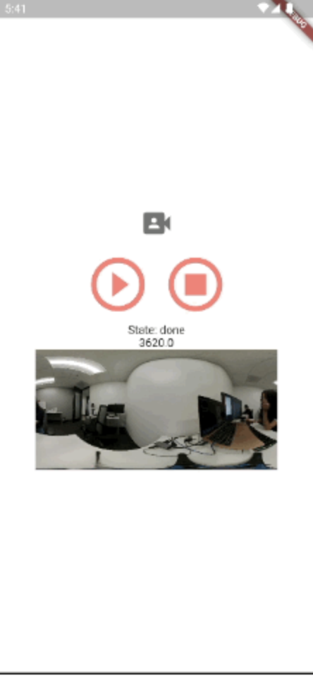
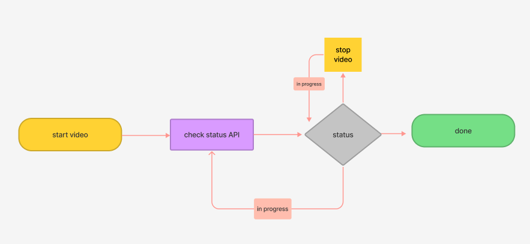

# THETA X Concept 7

After the startCapture command is run, the camera's status is in progress, until the user runs the stopCapture command. 



# Main Resources

* [RICOH THETA API](https://api.ricoh/docs/theta-web-api-v2.1/) 
* [theta360.guide developers community](https://theta360.guide/) 
* [Code for this tutorial](https://github.com/theta360developers/theta_x_gs7) 

* ## Concepts

The process id is parsed out from the `commands/execute` when the user starts the video. The id is passed into the state of the application and as a parameter for the `commands/status`. The `commands/status` outputs the state of the video command: inProgress or done.



### inProgress

The state of the process is `inProgress` while the camera is capturing the video. After the stopCapture command is run, the camera stitches the video together. The process is still `inProgress` even after stopping the video. The process is `done` once the video has finished stitching. While a video may be three seconds in duration, the process may take five seconds to complete.

## API Features

* [commands/status](https://api.ricoh/docs/theta-web-api-v2.1/protocols/commands_status/)
* [camera.startCapture](https://api.ricoh/docs/theta-web-api-v2.1/commands/camera.start_capture/)
* [camera.stopCapture](https://api.ricoh/docs/theta-web-api-v2.1/commands/camera.stop_capture/)
* [captureMode](https://api.ricoh/docs/theta-web-api-v2.1/options/capture_mode/)

## Steps

* Start capture with `commands/execute`. 
* Parse out the id from the response

```dart
    var convertResponse = jsonDecode(response.bodyString);
    var id = convertResponse['id'];
```

* Pass the process id into the state of the application and also into `commands/status`. With the specific id, the `commands/status` should emit the state of the video process.
* The `commands/status` is added in a while loop to the `commands/execute` until the state of the video process is done. A delay between calls prevents the application from crashing.
5. After the camera is finished processing, display the state to the screen. 

```dart
Text('State: ${state.cameraStatus}')
```

## Response Window

The stopCapture command outputs the file url of the last video. This file url is passesd into the state of the application and displayed as an image.

```dart
  state.fileUrl.isNotEmpty && state.cameraStatus == 'done'
    ? SizedBox(
        width: 300,
        child: Image.network(
            '${state.fileUrl}?type=thumb',))
        
```
