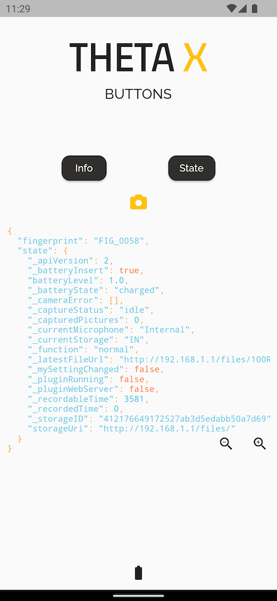
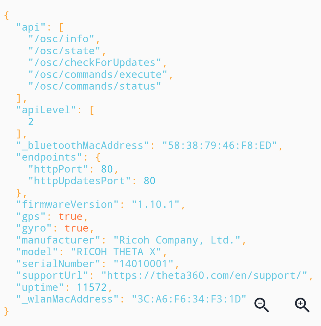
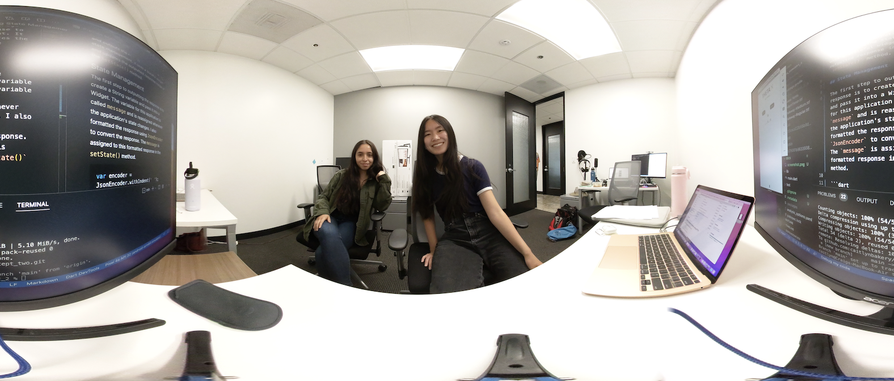

# Using State Management to show output from API commands

This tutorial is the second in a series aimed at helping developers learn how to work with the RICOH THETA X camera. It focuses on using the API to build a mobile app. The examples provided use Flutter to build mobile apps. Source code is downloadable and open to pull requests on GitHub.

# Main Resources

* [RICOH THETA API](https://api.ricoh/docs/theta-web-api-v2.1/)
* [theta360.guide developers community](https://theta360.guide/)
* [Code for this tutorial](https://github.com/theta360developers/theta_x_gs2)

# Main steps in using State Management

* Create a String variable and pass it into a Widget
* The variable is called `message` and is reassigned whenever the application's state changes
* The response from the camera is a JSON string (use `JsonEncoder`)
* Uses Flutter Syntax View to format the output nicely



This application connects to a RICOH THETA X camera with the http package from Dart and outputs the response to the screen using state management. State management is used to share the application state between screens, across an app. This app uses a Stateful widget and updates the outputted response inside of the `setState()` method. 

## State Management

The first step to outputting the response is to create a String variable and pass it into a Widget. The variable for this application is called `message` and is reassigned whenever the application's state changes. The response from the camera is a JSON string. This needs to be converted into the object format of the language being used. I formatted the response using `JsonEncoder` to convert the response. The `message` is assigned to this formatted response in the `setState()` method. 

```dart
var encoder = JsonEncoder.withIndent('  ');
var formattedResponse = encoder.convert(jsonDecode(response.body));
setState(() {
    message = formattedResponse;
});
```

## Syntax View

The application uses the [Flutter Syntax View](https://pub.dev/packages/flutter_syntax_view) package to display a certain theme. I used the `ayuLight` theme from the package.

```dart
child: SyntaxView(
code: message,
syntax: Syntax.DART,
syntaxTheme: SyntaxTheme.ayuLight(),
withLinesCount: false,
                )
```



## Taking Pictures 

This is a sample picture taken with the app. 


